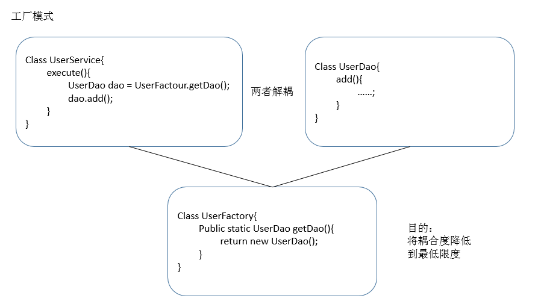
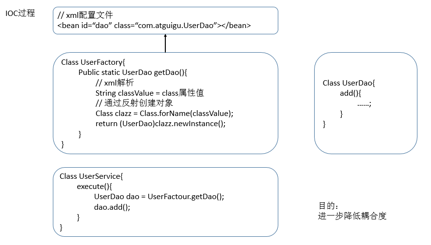
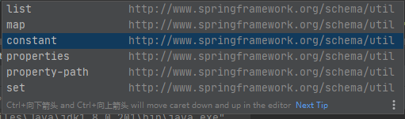
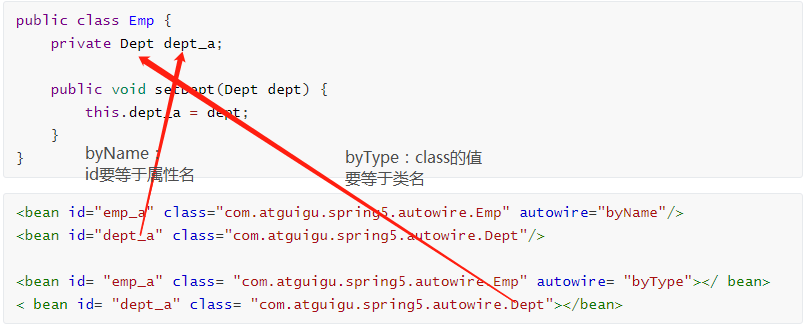
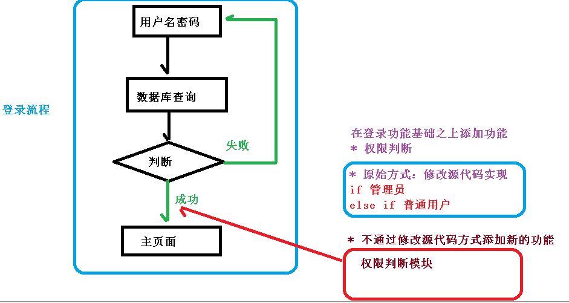

Spring5

## IOC容器

### IOC概念和原理

1. 控制反转，把对象的创建和对象之间的调用过程，交给Spring管理
2. 目的：降低耦合度
3. 入门案例就是IOC实现

### IOC底层原理






### IOC接口

提供了两个接口

1. BeanFactory：IOC的基本实现，是spring内部的使用接口，不提供给开发人员使用

   - 加载配置文件是不会创建对象，调用获取对象方法时才创建对象

2. ApplicationContext：BeanFactory的子接口，提供更多的功能，由开发人员使用

   - 加载配置文件时会创建对象。

3. ApplicationContext主要实现类：

   

   - FileSystemXmlApplicationContext：
     - 没有盘符的是项目工作路径，即项目的根目录：src/...
     - 有盘符表示的是文件绝对路径.
   - ClassPathXmlApplicationContext：只能读放在web-info/classes目录下的配置文件

## IOC操作Bean管理

Bean管理，指的是两个操作：

- spring创建对象
- spring注入属性

Bean管理操作两个方式

- 基于xml配置文件方式实现
- 基于注解实现

### Bean管理：基于xml实现

- 基于 xml 方式创建对象

    ```xml
    <!--配置User对象-->
    <bean id="user" class="com.atguigu.spring5.User"></bean>
    ```

	在spring 配置文件中，使用 bean 标签，标签里面添加对应属性，就可以实现对象创建

	在bean标签有很多属性，介绍常用的属性

	* id 属性：唯一标识
	* class 属性：类全路径（包类路径）

	创建对象时候，默认也是执行无参数构造方法完成对象创建，**在创建类时一定要有一个无参构造**

- 基于xml方式注入属性

    DI：依赖注入，IOC中的一种实现，需要在创建对象的基础上完成。

    - **使用set方法注入**

      主要有两步：先创建对象，再注入属性
        ```Java
        // class类
        public class Book {
            // 创建属性
            private String bname;
            private String bauthor;

            // 创建对应的有参构造方法
            public Book(String bname, String bauthor) {
                this.bname = bname;
                this.bauthor = bauthor;
            }

            // 创建对应的set方法
            public void setBname(String bname) {
                this.bname = bname;
            }

            public void setBauthor(String bauthor) {
                this.bauthor = bauthor;
            }

            public void printBookInfo() {
                System.out.println(bname + "::" + bauthor);
            }
        }
        ```
        ```xml
        <!--使用set方法进行属性注入-->
        <bean id="book" class="com.atguigu.spring5.Book">
            <property name="bname" value="高等数学"></property>
            <property name="bauthor" value="高等教育出版社"></property>
        </bean>
        ```

    - **使用有参构造方法注入**
      
      - 创建类，定义属性，创建属性对应有参数构造方法
        ```xml
        <bean id="book" class="com.atguigu.spring5.Book">
            <!--使用有参构造方法进行属性注入-->
            <constructor-arg name="bname" value="abc"/>
            <constructor-arg name="bauthor" value="china"/>
        </bean>
        ```
      
    - **使用p空间进行注入简化**

      一、添加 p 名称空间在配置文件中

      二、进行属性注入，在 bean 标签里面进行操作： p:bname="cnd" p:bauthor="hhh"

      注：等同于使用set方法注入，只是简化了代码而已。

      ```xml
      <?xml version="1.0" encoding="UTF-8"?>
      <beans xmlns="http://www.springframework.org/schema/beans"
             xmlns:xsi="http://www.w3.org/2001/XMLSchema-instance"
             xmlns:p="http://www.springframework.org/schema/p"
             xsi:schemaLocation="http://www.springframework.org/schema/beans http://www.springframework.org/schema/beans/spring-beans.xsd">
          <!--配置User对象-->
          <bean id="user" class="com.atguigu.spring5.User"/>
      
          
          <bean id="book" class="com.atguigu.spring5.Book" p:bname="cnd" p:bauthor="hhh">
              <!--使用有参构造方法进行属性注入-->
              <constructor-arg name="bname" value="abc"/>
              <constructor-arg name="bauthor" value="china"/>
          </bean>
      </beans>
      ```


#### xml 注入其他类型属性

1. 字面量

   - null值

     ```xml
     <property name="bauthor" >
         <null/>
     </property>
     ```

   - 特殊符号：使用xml特有的格式 --  \<![CDATA[内容]]>

     ```xml
     <property name="bname">
         <value><![CDATA[《高等数学》]]></value>
     </property>
     ```

2. 外部bean，其他类

   创建两个类service和dao类，在service的方法中调用dao的方法

   ```java
   public class UserService {
       // 在service的add方法中调用UserDao的方法
   
       // 创建UserDao类型属性，生成set方法
       private UserDao userDao;
   
       public void setUserDao(UserDao userDao) {
           this.userDao = userDao;
       }
   
       public void add(){
           System.out.println("service add................");
           userDao.update();
       }
   }
   ```

   ```xml
   <!-- 创建service和dao对象，接口不能作为对象，需要找它的实现类 -->
   <bean id="UserDaoImpl" class="com.atguigu.spring5.dao.UserDaoImpl"/>
   <bean id="userService" class="com.atguigu.spring5.service.UserService">
       <!-- 注入dao对象
               name：service类中的属性名称
               ref：创建userDao对象的bean标签的ID值
           -->
       <property name="userDao" ref="UserDaoImpl"/>
   </bean>
   ```

3. 内部bean

   使用员工和部门的例子来解释

   ```xml
   <!-- 内部bean-->
   <bean id="emp" class="com.atguigu.spring5.insidebean.Emp">
       <property name="ename" value="lucy"/>
       <property name="gender" value="女"/>
       <property name="dept">
        	<!-- name和id没有特别的联系-->   
           <bean id="dept" class="com.atguigu.spring5.insidebean.Dept">
               <property name="dname" value="安保部"/>
           </bean>
       </property>
   </bean>
   ```

4. 级联赋值

   ```xml
   <!-- 级联赋值-->
   <bean id="emp2" class="com.atguigu.spring5.insidebean.Emp">
       <property name="ename" value="Mike"/>
       <property name="gender" value="男"/>
       <!-- 需要先注入Dept类-->
       <property name="dept" ref="dept2"/>
       <!-- 然后通过Emp提供的getDept方法，得到Dept对象-->
       <property name="dept.dname" value="技术部"/>
   </bean>
   <bean id="dept2" class="com.atguigu.spring5.insidebean.Dept"/>
   ```

#### xml 注入集合属性

注入数组、List集合、Map集合、Set集合类型的属性

1. 创建类，定义数组、list、map、set 类型属性，生成对应 set 方法

   ```java
   public class Student {
       // 数组类型属性
       private String[] courses;
       // list集合类型属性
       private List<String> list;
       // map集合类型属性
       private Map<String,String> map;
       // set集合类型属性
       private Set<String> set;
   
       
       public void setSet(Set<String> set) {
           this.set = set;
       }
   
       public void setList(List<String> list) {
           this.list = list;
       }
   
       public void setMap(Map<String, String> map) {
           this.map = map;
       }
   
       public void setCourses(String[] courses) {
           this.courses = courses;
       }
   }
   ```

2. 在spring 配置文件进行配置

   ```xml
   <!-- 注入集合类型属性-->
   <bean id="student" class="com.atguigu.spring5.collectionbean.Student">
       <!-- 数组类型-->
       <property name="courses">
           <array>
               <value>语文</value>
               <value>数学</value>
               <value>英语</value>
           </array>
       </property>
       <!-- list类型-->
       <property name="list">
           <list>
               <value>张三</value>
               <value>小三</value>
           </list>
       </property>
       <!-- map类型-->
       <property name="map">
           <map>
               <entry key="JAVA" value="java"/>
               <entry key="PHP" value="php"/>
           </map>
       </property>
       <!-- set类型赋值-->
       <property name="set">
           <set>
               <value>MySQL</value>
               <value>Redis</value>
           </set>
       </property>
   </bean>
   ```

3. class类集合注入

   ```xml
   <bean id="student" class="com.atguigu.spring5.collectionbean.Student">
       <!-- List类型赋值，但是值是对象，需要用外部引用的方式-->
       <property name="courseList">
           <list>
               <ref bean="course1"/>
               <ref bean="course2"/>
           </list>
       </property>
   </bean>
   
   <!-- 创建多个course对象 -->
   <bean id="course1" class="com.atguigu.spring5.collectionbean.Course">
       <property name="cname" value="政治"/>
   </bean>
   <bean id="course2" class="com.atguigu.spring5.collectionbean.Course">
       <property name="cname" value="历史"/>
   </bean>
   ```

4. 公共部分提取

   - 在spring 配置文件中引入名称空间 util

   主要以下两语句：
   
   - xmlns:util="http://www.springframework.org/schema/util" 
   - http://www.springframework.org/schema/util     http://www.springframework.org/schema/util/spring-util.xsd
   
   ```xml
   <beans xmlns="http://www.springframework.org/schema/beans"
          xmlns:xsi="http://www.w3.org/2001/XMLSchema-instance"
          xmlns:p="http://www.springframework.org/schema/p"
          xmlns:util="http://www.springframework.org/schema/util"
          xsi:schemaLocation="http://www.springframework.org/schema/beans http://www.springframework.org/schema/beans/spring-beans.xsd
                              http://www.springframework.org/schema/util http://www.springframework.org/schema/util/spring-util.xsd">
   </beans>
   ```

   
   - 使用 util 标签完成 list 集合注入提取
   
   ```xml
   <util:list id="courseList">
       <value>张三</value>
       <value>小三</value>
   </util:list>
   <property name="list" ref="courseList"></property>
   ```

    util 标签的其他集合

   


### Bean管理：工厂bean

Spring有两种类型 bean，一种普通 bean，另外一种工厂 bean（FactoryBean）

- 普通 bean ：在配置文件中定义 bean 类型就是返回类型

- 工厂 bean ：在配置文件定义 bean 类型可以和返回类型不一样，you

  - 要实现FactoryBean接口，并通过实现该接口中的getObject()方法来返回其他类型的bean

  - 注：在使用Context的getBean方法时，第二个参数要填写返回的那个类型

    ```java
    ApplicationContext context = new FileSystemXmlApplicationContext("config.xml");
    Course course = context.getBean("mybean", Course.class);
    System.out.println(course);
    ```

```java
// 第一步:创建类，让这个类作为工厂bean，实现接口FactoryBean
public class MyBean implements FactoryBean<Course> {
	// 第二步:实现接口里面的方法，在实现的方法中定义返回的bean类型
    @Override
    public Course getObject() throws Exception {
        Course course = new Course();
        course.setCname("HelloWorld");
        return course;
    }

    @Override
    public Class<?> getObjectType() {
        return null;
    }

    @Override
    public boolean isSingleton() {
        return false;
    }
}

```

```xml
<!--工厂bean-->
<bean id="mybean" class="com.atguigu.spring5.factorybean.MyBean"/>
```

### Bean管理：bean作用域

在 Spring 里面，可以设置创建 bean 实例是单实例还是多实例

默认情况下， 默认情况下，bean 是单实例对象

```java
@Test
public void testEmp(){
    ApplicationContext context = new FileSystemXmlApplicationContext("config.xml");
    Emp emp = context.getBean("emp2",Emp.class);
    Emp emp2 = context.getBean("emp2",Emp.class);
    
    System.out.println(emp); // com.atguigu.spring5.insidebean.Emp@70a9f84e
    System.out.println(emp2); // com.atguigu.spring5.insidebean.Emp@70a9f84e
}
```

如何设置单实例还是多实例：在 spring 配置文件 bean 标签里面有属性（scope）用于设置单实例还是多实例

```xml
<bean id="emp2" class="com.atguigu.spring5.insidebean.Emp" scope="prototype"></bean>
<bean id="emp2" class="com.atguigu.spring5.insidebean.Emp" scope="singleton"></bean>
```

singleton 和 prototype 区别

- scope 值是singleton 时候，加载 spring 配置文件时候就会创建单实例对象
- scope 值是 prototype 时候，不是在加载 spring 配置文件时候创建 对象，在调用getBean 方法时候创建多实例对象

### Bean管理：生命周期

无后置处理器，bean 生命周期有wu步

1. 通过构造器创建 bean 实例（无参数构造）
2. 为 bean 的属性设置值和对其他 bean 引用（调用 set 方法）
3. 调用 bean 的初始化的方法（**需要进行配置初始化的方法**）
4. bean 可以使用了（对象获取到了）
5. 当容器关闭时候，调用 bean 的销毁的方法（**需要进行配置销毁的方法**）

```java
public class Order {
    private String oname;
    
    public Order() {
        System.out.println("第一步 执行无参数构造创建bean实例");
    }
    
    public void setOname(String oname) {
        this.oname = oname;
        System.out.println("第二步 调用set方法设置属性值");
    }

 
    //创建执行的初始化的方法
    public void initMethod() {
        System.out.println("第三步 执行初始化的方法");
    }

    //创建执行的销毁的方法
    public void destroyMethod() {
        System.out.println("第五步 执行销毁的方法");
    }
}

@Test
public void testLifeCycle(){
    ApplicationContext context = new FileSystemXmlApplicationContext("config.xml");
    Order order = context.getBean("order", Order.class);
    System.out.println("第四步 获取创建bean实例对象");
    System.out.println(order);
    // 手动销毁
    ((FileSystemXmlApplicationContext)context).close();
}
```

```xml
<!--bean生命周期-->
<bean id="order" class="com.atguigu.spring5.lifecycle.Order"
      init-method="initMethod"
      destroy-method="destroyMethod">
    <property name="oname" value="手机"/>
</bean>
```

有后置处理器，bean 生命周期有七步

**如果有个类实现了BeanPostProcessor，那么在配置文件中该bean会对你当前配置文件中的所有bean都添加后置处理器**

1. 通过构造器创建 bean 实例（无参数构造）
2. 为 bean 的属性设置值和对其他 bean 引用（调用 set 方法）
3. 把 n bean 实例传递 n bean 后置处理器的方法 postProcessBeforeInitialization
4. 调用 bean 的初始化的方法（需要进行配置初始化的方法）
5. 把 bean 实例传递 bean 后置处理器的方法 postProcessAfterInitialization
6. bean 可以使用了（对象获取到了）
7. 当容器关闭时候，调用 bean 的销毁的方法（需要进行配置销毁的方法）

```java
public class myPostProcessor implements BeanPostProcessor {
    // BeanPostProcessor有默认方法


    @Override
    public Object postProcessBeforeInitialization(Object bean, String beanName) throws BeansException {
        System.out.println("在初始化之前执行的方法");
        return bean;
    }

    @Override
    public Object postProcessAfterInitialization(Object bean, String beanName) throws BeansException {
        System.out.println("在初始化之后执行的方法");
        return bean;
    }
}
```

```xml
<!--后置处理器，添加之后上面所有bean都会认为添加了后置处理器-->
<bean id="myPostBean" class="com.atguigu.spring5.lifecycle.myPostProcessor"/>
```

想到个问题，这些都是静态输入，有没有动态输入的方法

### Bean管理：自动装配

根据指定装配规则（属性名称或者属性类型），Spring 自动将匹配的属性值进行注入

两种自动装配方法：

- byName 根据属性名称注入 ，注入值 bean 的 id 值和类属性名称一样
- byType 根据属性类型注入



```java
public class Emp {
    private Dept dept_a;

    public void setDept(Dept dept) {
        this.dept_a = dept;
    }
}
```

```xml
<bean id="emp_a" class="com.atguigu.spring5.autowire.Emp" autowire="byName"/>
<bean id="dept_a" class="com.atguigu.spring5.autowire.Dept"/>

<bean id= "emp_a" class= "com.atguigu.spring5.autowire.Emp" autowire= "byType"></ bean>
< bean id= "dept_a" class= "com.atguigu.spring5.autowire.Dept"></bean>
```

### Bean管理：引入外部文件

直接配置数据库信息


### bean管理：基于注解实现

使用注解目的：简化 xml 配置

#### 基于注解方式创建对象

- @Component
- @Service：业务逻辑层
- @Controller：一般用在web层上
- @Repository：用在DAO层

上面四个注解功能是一样的，都可以用来创建 bean 实例

##### 操作步骤

1. 引入依赖：AOP：spring-aop-5.2.6.RELEASE.jar

2. 开启组件扫描

   1. 引入命名空间：xmlns:context="http://www.springframework.org/schema/context"
   2. 开启组件扫描：<context:component-scan base-package="com.atguigu.spring5.annotation"/>

   ```xml
   <?xml version="1.0" encoding="UTF-8"?>
   <beans xmlns="http://www.springframework.org/schema/beans"
          xmlns:xsi="http://www.w3.org/2001/XMLSchema-instance"
          xmlns:context="http://www.springframework.org/schema/context"
          xsi:schemaLocation="http://www.springframework.org/schema/beans http://www.springframework.org/schema/beans/spring-beans.xsd http://www.springframework.org/schema/context https://www.springframework.org/schema/context/spring-context.xsd">
   
       <!--
           开启组件扫描
           1 如果扫描多个包，多个包使用逗号隔开
           2 或者扫描包上层目录
       -->
       <context:component-scan base-package="com.atguigu.spring5.annotation"/>
   </beans>
   ```

3. 创建类，在类上面添加创建对象注解

   ```Java
   //在注解里面value属性值等同于bean中的id值，在这可以省略不写，
   //默认值是类名称，首字母小写：UserService -- userService
   @Component(value = "abc")
   public class UserService {
       public void add() {
           System.out.println("service add......");
       }
   }
   ```

##### 开启组件扫描细节配置

- use-default-filters = "false"  ：不使用默认过滤器，扫描内容自己配置

  - context:include-filter：设置扫描哪些内容

  ```xml
  <context:component-scan base-package="com.atguigu.spring5.annotation" use-default-filters="false">
      <!--表示扫描Component类型的注解-->
      <context:include-filter type="annotation" expression="org.springframework.stereotype.Component"/>
  </context:component-scan>
  ```

- context:exclude-filter：设置哪些内容不进行扫描

  ```xml
  <context:component-scan base-package="com.atguigu.spring5.annotation">
      <!--扫描所有，但是不扫描Controller类型的注解-->
      <context:exclude-filter type="annotation" expression="org.springframework.stereotype.Controller"/>
  </context:component-scan>
  ```

#### 基于注解方式注入属性

- @Autowired：根据属性类型进行自动装配，**只针对只有一个实现类的属性**

  ```Java
  @Repository(value = "userDaoImpl")
  public class UserDaoImpl implements UserDao {
      @Override
      public void add() {
          System.out.println("dao add........");
      }
  }
  ```

  ```Java
  @Service
  public class UserService {
      @Autowired
      private UserDao userDao;
  
      public void add() {
          System.out.println("service add......");
          userDao.add();
      }
  }
  ```

- @Qualifier：根据属性名称进行注入，需要配合Autowired使用，**可以实现有多个实现类的属性的注入**

  - @Autowired负责对应属性类型，@Qualifier负责对应的实现类
  - @Qualifier的value值就是某个实现类的类名

  ```Java
  @Service
  public class UserService {
      @Autowired
      @Qualifier(value = "userDaoImpl") // 要跟它的value相同：@Repository(value = "userDaoImpl")
      private UserDao userDao;
  
      public void add() {
          System.out.println("service add......");
          userDao.add();
      }
  }
  ```

- @Resource：可以根据类型注入，可以根据名称注入

  - Autowired+Qualifier可以找到对应的一个类，或者使用Resource注解也可以
  - 注：@Resource是在javax.annotation.Resource中，是JavaEE提供的，在JDK11中就没有了。

  ```Java
  @Service
  public class UserService {
  	// 可以认为是类型+名称，即@Autowired + @Qualifier；不加name就是@Autowired
      @Resource(name = "userDaoImpl")
      private UserDao userDao;
  
      public void add() {
          System.out.println("service add......");
          userDao.add();
      }
  }
  ```

  

- @Value：注入普通类型属性


## AOP：面向切面编程

### AOP概念

面向切面编程（方面），利用AOP可以对业务逻辑的各个部分进行隔离，从而使得业务逻辑各部分之间的耦合度降低，提高程序的可重用性，同时提高了开发的效率。

**通俗描述**：不通过修改源代码方式，在主干功能里面添加新功能

**举例说明：**

在原本的登录流程中，如果你想添加“权限判断”的功能，使用AOP的话就是先写好该功能的代码（函数，类），然后通过配置把它加到主流程中，也可以通过配置方式取消该功能。



### 底层原理：动态代理

#### 代理设计模式原理

使用一个代理将对象包装起来, 然后用该代理对象取代原始对象。

**任何对原始对象的调用都要通过代理**。代理对象决定是否以及何时将方法调用转到原始对象上。

动态代理是指客户通过代理类来调用其它对象的方法，**并且是在程序运行时根据需要动态创建目标类的代理对象。**

#### Java 动态关代理相关API

**Proxy** ：专门完成代理的操作类，是所有动态代理类的父类。通过此类为一个或多个接口动态地生成实现类。

**InvocationHandler**：用于实现代理类中调用被代理类的同名方法

#### 动态代理步骤

实现动态代理要解决的两个问题

 * 如何根据加载到内存中的被代理类，动态的创建一个代理类及其对象——使用 java.lang.reflect.Proxy 这个类
 * 如何通过代理类的对象调用被代理类的同名方法——使用 InvocationHandler 这个接口，被代理类的增强方法在这里实现

```Java
package DesignPattern.Proxy.dynamicproxy;

import java.lang.reflect.InvocationHandler;
import java.lang.reflect.Method;
import java.lang.reflect.Proxy;


/**
 * @author ChenZT
 */

interface Human {
    String getBelief();

    void eat(String food);
}

// 被代理类
class SuperMan implements Human {

    @Override
    public String getBelief() {
        return "I believe I can fly!";
    }

    @Override
    public void eat(String food) {
        System.out.println("我喜欢吃：" + food);
    }
}


/*
 * 想要实现动态代理，需要解决的问题？
 * 一：如何根据加载到内存中的被代理类，动态的创建一个代理类及其对象
 * 二：如何通过代理类的对象调用被代理类的同名方法
 * */
class ProxyFactory {
    // 解决问题一
    // 输入参数：obj 被代理类
    // 返回值：代理类对象
    public static Object getProxyInstance(Object obj) {
        MyInvocationHandler handler = new MyInvocationHandler();
        handler.bind(obj);
        // 三个参数：被代理类的加载器，被代理类的实现接口，InvocationHandler的实现类对象
        return Proxy.newProxyInstance(obj.getClass().getClassLoader(), obj.getClass().getInterfaces(), handler);
    }
}

class MyInvocationHandler implements InvocationHandler {
    private Object obj;

    public void bind(Object obj) {
        this.obj = obj;
    }

    /**
     * 调用代理类的同名方法
     *
     * @param proxy  代理类对象
     * @param method 接口中的要调用的同名方法
     * @param args   调用方法的参数
     * @return 调用方法的返回值
     */
    @Override
    public Object invoke(Object proxy, Method method, Object[] args) throws Throwable {
        //那添加的其他功能的代码写在这里
        return method.invoke(obj, args);
    }
}


public class DynamicProxyTest {
    public static void main(String[] args) {
        SuperMan superMan = new SuperMan();
        Human instance = (Human) ProxyFactory.getProxyInstance(superMan);
        System.out.println(instance.getBelief());
        instance.eat("海底捞");
    }
}
```

### AOP术语

连接点：类中哪些方法**理论上**可以被增强，这些方法称为连接点

切入点：**实际上**被真正增强的方法，称为切入点

通知（增强）：添加的新代码或者功能

- 通知的类型
  - 前置通知：在原方法前执行
  - 后置通知：在原方法后执行
  - 环绕通知：在原方法前后都执行
  - 异常通知：原方法出现异常执行，类似try/catch
  - 最终通知：有误异常都执行，类似finally

切面：指通知应用到切入点的过程

### AOP准备工作

Spring框架一般基于**AspectJ**实现AOP操作，AspectJ不是Spring组成部分，而是独立AOP框架，一般把AspectJ和Spirng框架一起使用，进行AOP操作

基于AspectJ实现AOP操作

- 基于xml文件
- 基于注解

引入 AOP 相关依赖

- spring-aspects-5.2.6.RELEASE
- aspectjweaver-1.9.5
- aopalliance-1.0
- cglib-2.2

切入点表达式

- 切入点表达式作用：知道对哪个类里面的哪个方法进行增强
- 语法结构： execution([权限修饰符] [返回类型] [类全路径] [方法名称] ([参数列表]) )
- 举例：
  - 对 com.atguigu.dao.BookDao 类里面的 add 进行增强： execution(* com.atguigu.dao.BookDao.add(..))
  - 对 com.atguigu.dao.BookDao 类里面的所有的方法进行增强：execution(* com.atguigu.dao.BookDao.* (..))
  - 对 com.atguigu.dao 包里面所有类，类里面所有方法进行增强：execution(* com.atguigu.dao.*.* (..))

## JDBC Template

Spring 框架对 JDBC 进行封装，使用 JdbcTemplate 方便实现对数据库操作

### 准备工作

- 引入相关jar包

  - 德鲁伊连接池：druid-1.1.9.jar
  - mysql：mysql-connector-java-8.0.20.jar
  - spring-jdbc-5.2.6.RELEASE.jar
  - spring-tx-5.2.6.RELEASE.jar
  - spring-orm-5.2.6.RELEASE.jar

- 在spring配置文件配置数据库连接池

  ```xml
  <bean id="dataSource" class="com.alibaba.druid.pool.DruidDataSource" destroy-method="close">
      <property name="url" value="jdbc:mysql://localhost:3306/myemployees?serverTimezone=UTC"/>
      <property name="username" value="root"/>
      <property name="password" value="......"/>
      <property name="driverClassName" value="com.mysql.cj.jdbc.Driver"/>
  </bean>
  ```

- 配置 JdbcTemplate 对象，注入 DataSource

  ```xml
  <bean id="jdbcTemplate" class="org.springframework.jdbc.core.JdbcTemplate">
      <property name="dataSource" ref="dataSource"/>
  </bean>
  ```

- 创建 service 类，创建 dao 类，在 dao 注入 jdbcTemplate 对象

  service注入dao，daoImpl注入jdbcTemplate 

  ```Java
  public interface EmployeeDao {
      public void print();
  }
  
  @Repository
  public class EmployeeDaoImpl implements EmployeeDao {
  
      @Autowired
      private JdbcTemplate jdbcTemplate;
  
      @Override
      public void print() {
          System.out.println("helloworld");
      }
  }
  
  @Service
  public class EmployeeService {
      @Autowired
      @Qualifier(value = "EmployeeDaoImpl")
      private EmployeeDao employeeDao;
  }
  
  ```

### JDBC操作：添加

一、一个表创建一个对应类

```Java
public class Job {
    private String job_id;
    private String job_title;
    private int min_salary;
    private int max_salary;
    
    // setter getter 方法
}
```

二、编写service、dao和测试类

```Java
public interface EmployeeDao {
	// 接口添加操作
    void add(Job job);
}

@Repository
public class EmployeeDaoImpl implements EmployeeDao {

    @Autowired
    private JdbcTemplate jdbcTemplate;

    // 实现添加操作
    @Override
    public void add(Job job) {
        // 创建sql语句
        String sql = "insert into jobs values (?,?,?,?)";
        // 参数
        Object[] args = {job.getJob_id(), job.getJob_title(), job.getMin_salary(), job.getMax_salary()};
        // 用JdbcTemplate完成添加操作
        int update = jdbcTemplate.update(sql, args);
        System.out.println(update);
    }
}

@Service
public class EmployeeService {
    @Autowired
    private EmployeeDao employeeDao;
	
    // service添加方法就调用DAO的add方法
    public void add(Job job) {
        employeeDao.add(job);
    }
}

// 测试类
public class testJdbcTemplate {
    @Test
    public void testAdd() {
        ApplicationContext context = new FileSystemXmlApplicationContext("JDBCConfig.xml");
        EmployeeService service = context.getBean("employeeService", EmployeeService.class);
        Job job = new Job();
        job.setJob_id("ST_MAN2");
        job.setJob_title("Stock Manager2");
        job.setMin_salary(2000);
        job.setMax_salary(3000);
        service.add(job);
    }
}
```
